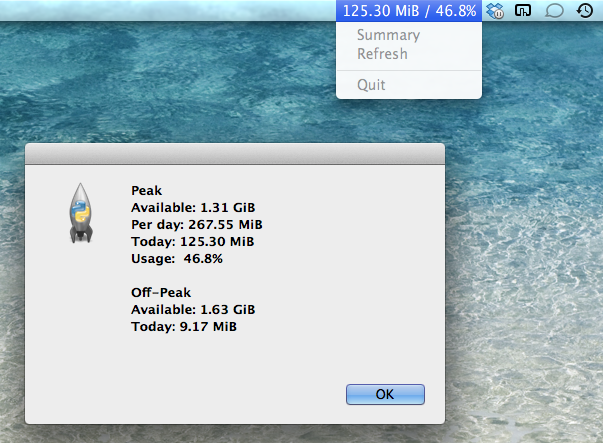

Vodacom Data Usage
==================

A Mac OS X menu bar status item to show your daily quota usage. It retrieves your available balance directly every hour from the Vodacom website. If you have an appropriate local data usage monitor, it can retrieve your usage split between peak and off-peak.

# Dependencies
* Python 2.7 or newer
* [Xcode Command-Line Tools](https://developer.apple.com/xcode/)
* [rumps: Ridiculously Uncomplicated Mac OS X Python Statusbar apps](https://github.com/jaredks/rumps)
* [vnstat](http://humdi.net/vnstat/)

# Errors
Check the log file.

# Credits
Thank you to [dryicons](http://dryicons.com/) for the [Coquette Icon Set](http://dryicons.com/free-icons/preview/coquette-icons-set/).