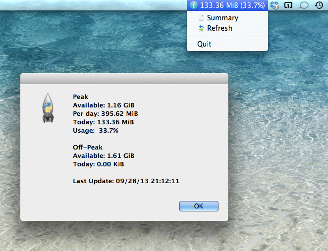

Vodacom Data Usage
==================

A Mac OS X menu bar status item to show your daily quota usage. It retrieves your available balance directly every hour from the Vodacom website. If you have an appropriate local data usage monitor, it can retrieve your usage split between peak and off-peak.

# Dependencies
* Python 2.7 or newer
* [Xcode Command-Line Tools](https://developer.apple.com/xcode/)
* [rumps: Ridiculously Uncomplicated Mac OS X Python Statusbar apps](https://github.com/jaredks/rumps)
* [vnstat](http://humdi.net/vnstat/)

NOTE: The original rumps repository is defective since the launch of Mac OS X Mavericks, so rather use [this](tail -f /var/log/Vodacom Data Usage.log) alternative. 

# Installation
* Download this code
* Install `scripts/get_today_hourly_usage.sh` on your internet gateway in `~/Scripts/get_today_hourly_usage.sh` for a user with SSH keys set up (this is the default, but you can configure it to execute locally; check the monitor setting in the configuration file)
* Create directory and copy downloaded contents to `/usr/local/vodacom_data_usage/` and run `chown -R root:wheel /usr/local/vodacom_data_usage/`
* Copy the plist file to `/Library/LaunchAgents/` (and `chown` like above)
* Update the config file with your details: `/usr/local/vodacom_data_usage/conf\Vodacom Data Usage.conf`
* Run `launchctl load -w /Library/LaunchAgents/com.whatsthatlight.VodacomDataUsage.plist` to install it to auto start (it will start immediately)
* Run `tail -f /var/log/Vodacom Data Usage.log` to monitor the app

# Errors
Check the log file.

# Credits
Thank you to [dryicons](http://dryicons.com/) for the [Coquette Icon Set](http://dryicons.com/free-icons/preview/coquette-icons-set/).
